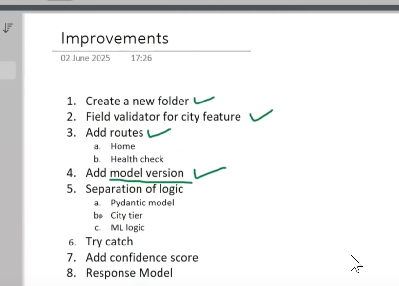

Setup
1. Install Docker
2. Create account on Docker Hub
Step 1 - Create a Dockerfile
Step 2 - Build the docker image [docker build -t ishuman/insurance-premium-api .]
Step 3 - Login to Docker Hub [docker login]
Step 4 - Push the image to Docker Hub [docker push ishuman/insurance-premium-api]       
Step 5 - Pull the docker image [docker pull ishuman/insurance-premium-api]
Step 6 - Run the docker image locally [docker run -d -p 8000:8000 ishuman/insurance-premium-api]


## Deploying on AWS EC2 instance

create an EC2 instancel
Connect to the EC2 instance
Run the following commands
```
    sudo apt-get update
    sudo apt-get install -y docker.io
    sudo systemctl start docker
    sudo systemctl enable docker
    sudo usermod -aG docker $USER
    exit
```
Restart a new connection to EC2 instance
Run the following commands
a. docker pull tweakster24/insurance-premium-api:latest
b. docker run -p 8000:8000 tweakster24/insurance-premium-api
ange security group settings
Check the API